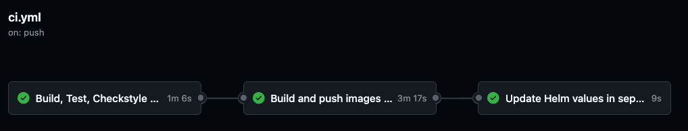
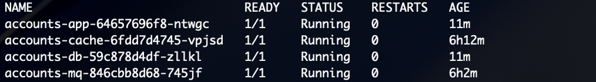
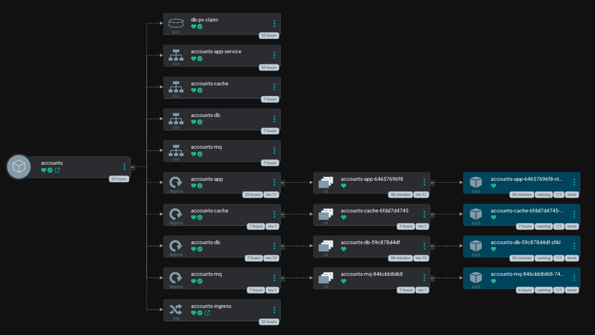

# gitops-app

A Java web application and the CI pipeline that builds it. On every push to
`main`, GitHub Actions builds the image, scans it, pushes it to ECR and
commits the new image tag to a separate config repo, which ArgoCD picks up
and deploys.

Part of a three repo GitOps project:
- **gitops-app** (this repo) - the application and its CI pipeline
- [gitops-config](https://github.com/tunasahinoglu/gitops-config) - Helm
  chart and ArgoCD manifests, the repo ArgoCD watches
- [gitops-infra](https://github.com/tunasahinoglu/gitops-infra) - Terraform
  for the VPC and EKS cluster

The application is a multi tier Java app (Tomcat, MySQL, RabbitMQ, Memcached)
based on an open source reference project. The focus here is the pipeline
and not the app code.

## CI pipeline

Every push to `main` runs two stages:

1. **Build, test, quality gate.** Unit tests, Checkstyle and a SonarQube scan
   with a quality gate. If this fails, nothing gets built or deployed.
2. **Build, scan, push, deploy.** Builds the app and database images, scans
   both with Trivy, pushes to ECR, then updates the image tags in the config
   repo with `yq`.

CI never talks to the cluster directly. It only changes what's declared in
Git and ArgoCD reconciles the cluster to match.

## Live access

The app runs behind an ALB and syncs through ArgoCD.

## Configuration

No credentials are committed. `application.properties` reads database,
RabbitMQ and admin credentials from environment variables, supplied as
Kubernetes secrets at deploy time.

The CI workflow expects these repository secrets:

| Secret | Purpose |
|--------|---------|
| `AWS_ACCESS_KEY_ID` / `AWS_SECRET_ACCESS_KEY` | Pushing to ECR |
| `SONAR_TOKEN` | SonarQube authentication |
| `GITOPS_PAT` | Write access to the config repo |
| `HELM_REPO_USER` | GitHub username for the config repo clone |

And these repository variables: `AWS_REGION`, `ECR_REPOSITORY`,
`ECR_DB_REPOSITORY`, `HELM_REPO_NAME`, `SONAR_HOST_URL`.